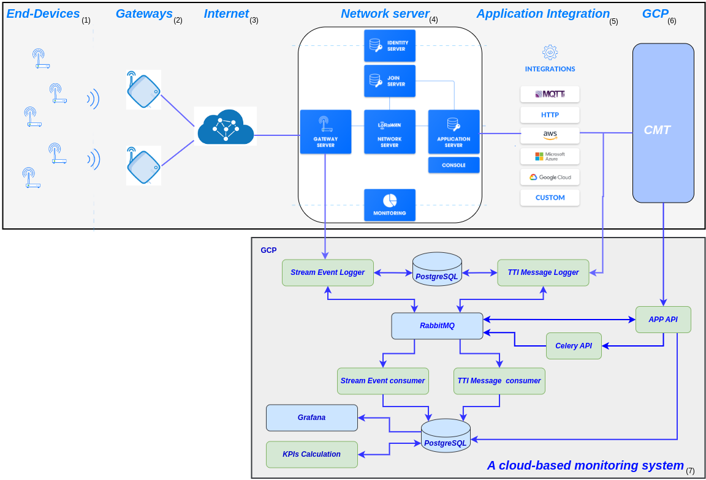

# LoRaWAN Network management
Overview:

LoRaWAN (Long Range Wide Area Network) is a wireless technology that facilitates long-range communication between IoT devices, making it an increasingly popular choice for businesses. However, managing the complexity of LoRaWAN networks can be challenging, particularly as the number of IoT devices grows. Inefficient resource management can lead to significant costs for businesses, including slower network speeds, increased latency, and reduced network range. Therefore, proper management of LoRaWAN networks is essential to maintain their reliability and security while optimizing resource allocation to reduce costs.

This repository code aims to provide effective LoRaWAN network management by ensuring network reliability, troubleshooting issues as they arise, optimizing resource allocation, ensuring network security, complying with regulations, and ensuring scalability. Network administrators can use this code to monitor network performance metrics, detect and troubleshoot issues quickly, implement security measures to protect against potential threats, and allocate network resources effectively to ensure that all devices receive the necessary resources for proper operation.

By effectively managing these components, network administrators can ensure that the LoRaWAN network operates smoothly, securely, and efficiently, allowing organizations to leverage the full potential of IoT.

## System Architecture

The following is the architectural design for collecting metadata to calculate the KPIs for network monitoring.

 
## Main Components of the System Architecture

The system architecture includes the following components:

- **App API/Backend:** The interface and backend services for the application.
- **Stream Event Logger Module:** Logs stream events from TTI for monitoring.
- **TTI Message Logger Module:** Logs application TTI messages for tracking.
- **Stream Event Consumer Module:** Processes stream event messages.
- **TTI Message Consumer Module:** Processes application TTI messages.
- **KPIs Calculation Module:** Calculates key performance indicators for the LoRaWAN network.
- **RabbitMQ:** A message broker that enables communication between system parts.
- **PostgreSQL:** A relational database management system for storing data.
- **pgAdmin:** A web-based tool for managing PostgreSQL.
- **Grafana:** A tool for data visualization and monitoring.
- **API-Celery:** A distributed task queue for asynchronous task processing.
  

## Installation

1. Clone the repository:   " git clone  " 
  

## Configuration

To configure the project, follow these steps:

1. Review the configuration section in each README.md file for all the microservices in the project. Update the necessary variables and settings as specified.
2. Add the `TTI_AUTH` value in the `docker-compose.yml` file. Obtain this value from the TTI network server for authentication purposes.

After completing these configuration steps, the project will be ready to run.

## Usage

To use the project, follow these steps:

- Start the services:
  \`\`\`
  make start
  \`\`\`
- Open a web browser and navigate to the application URL: [http://localhost:5000/docs#/](http://localhost:5000/docs#/)
- Open a web browser and navigate to the pgAdmin URL: [http://localhost:5050/browser/](http://localhost:5050/browser/)
- Open a web browser and navigate to the RabbitMQ URL: [http://localhost:15672/#/](http://localhost:15672/#/)

## Makefile Commands

The following Makefile commands are available for managing the project:

- **start**: Starts the services. Additional arguments can be passed using the `ARGS` parameter, e.g.,
  \`\`\`
  make start ARGS="--option1 value1"
  \`\`\`
- **stop**: Stops the services. Additional arguments can be passed using the `ARGS` parameter.
- **restart**: Stops and starts the services.
- **delete**: Deletes a specific container. Additional arguments can be passed using the `ARGS` parameter, e.g.,
  \`\`\`
  make delete ARGS="-c my_container_name -d"
  \`\`\`
- **delete-all**: Deletes all containers. Additional arguments can be passed using the `ARGS` parameter.
- **test-all-local**: Runs all tests locally.

To execute these commands, navigate to the root directory of the project and run the desired command using the `make` command, e.g.,
\`\`\`
make start,
make stop,
make delete,
make delete-all,
make test-all-local
\`\`\`

## Contributors

- Sobhi Alfayoumi
- Xavier Vilajosana
 